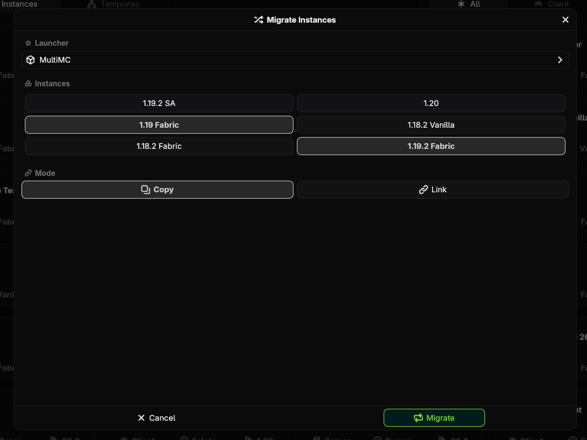
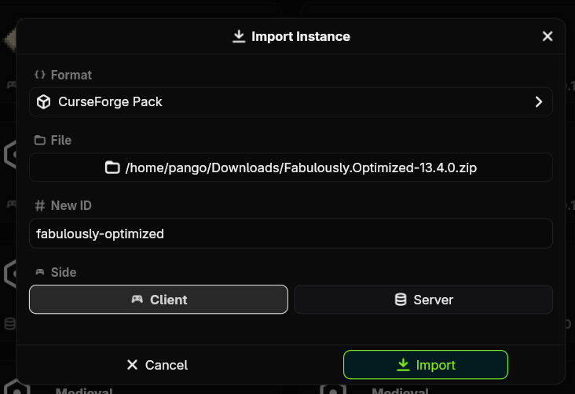
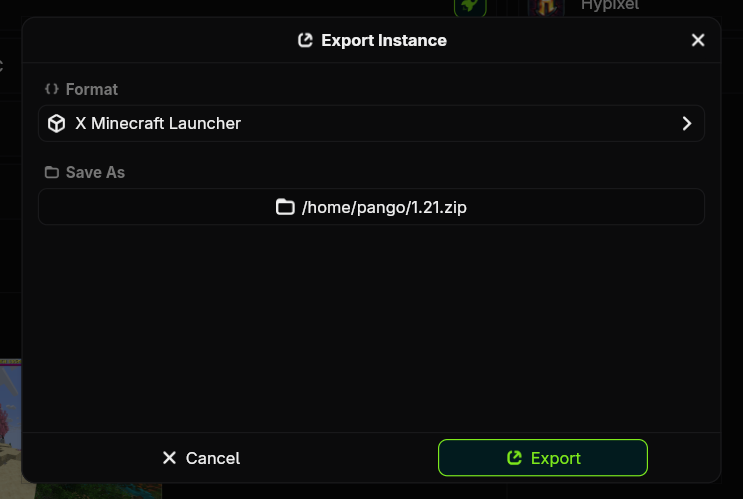

# Importing and Exporting

Nitrolaunch has a dedicated system for importing, exporting, and migrating from other launchers and formats.

## Getting Plugins

First, you need to make sure you have the plugins you need for the formats you are using. MultiMC, PrismLauncher, XMinecraftLauncher, and Mojang Launcher are supported from the default plugins out of the box. Importing modpacks from Modrinth and CurseForge are also supported by their respective plugins.

## Migrating

If you are coming from another launcher, there is no need to export each file manually. Nitrolaunch can find the launcher on your computer and import all of the instances with no extra steps.

+++ App
On the home page, click the `+ New` button in the top left, and select `Migrate Instances`.

Select the launcher to migrate from, and Nitro will scan it to find what instances it has. Select any instances you want to import, or select none of them to import all instances.

+++ CLI
Run the `nitro migrate` command to start migrating and follow the prompts.
+++

### Copy vs Link
- Copy: Copy every single file from the instances to create totally new ones. Changes made to your Nitro instances will not affect the original ones.
- Link: Run the Nitrolaunch instances using the original instance directories. Changes made to your Nitro instances, like save data or settings, will affect the original instances.

## Importing

+++ App
On the home page, click the `+ New` button in the top left, and select `Import Instance`.

Select the format you are importing in, the file you want to import, and an ID for the new instance. Then select a side if it is needed and click `Import`.

+++ CLI
Use the `nitro instance import <path/to/file>` command and follow the prompts to import the new instance.
+++

## Exporting

+++ App
On the instance page, click the `More` button and select the `Export` option. Select the format and the path for the output file, then click `Export`.

+++ CLI
Use the `nitro instance export <path/to/new/file>` command and follow the prompts.
+++