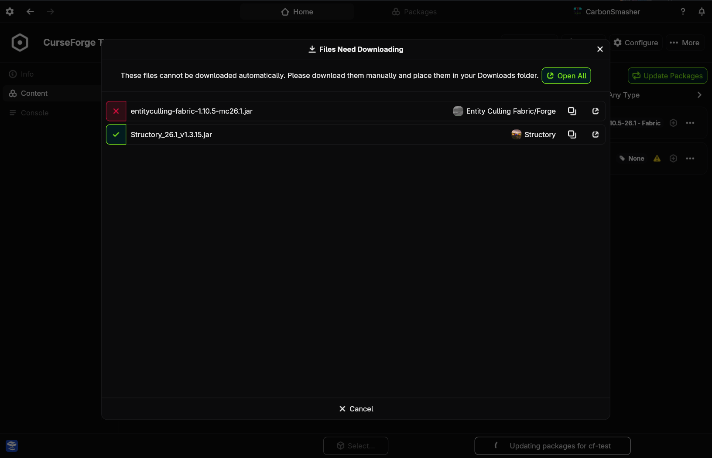
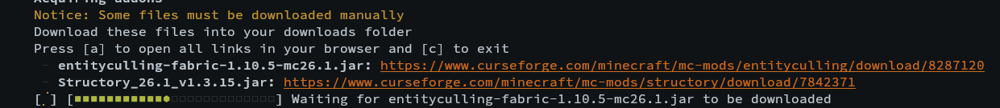

# Manual Files

Certain package repositories (specifically CurseForge) have certain packages that the authors want users to download from the original website rather than automatically in order to support the project authors.

Nitrolaunch has a system that handles this cleanly. When you update an instance or import a modpack that requires manual file downloads, a prompt will appear.

+++ App

+++ CLI

+++

The prompt will show you which files need downloading, give you links and update as files are downloaded. You can also `Open All` to open all of the links easily. Nitro will try to open them in their own window so it's easy to close out when you are done.

The files **must** be downloaded into your `Downloads` folder inside of your user home directory.