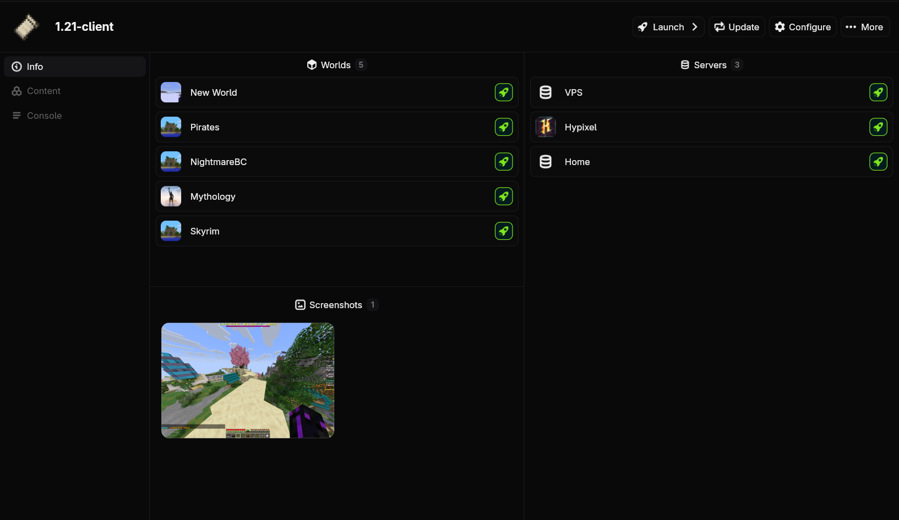

# Quick Play

Quick play is a feature that lets you instantly launch into a world, server, or realm when Minecraft starts.

## Launching Worlds

+++ App
Go to the instance page and click on one of the launch buttons next to the world you want to play.
+++ CLI
Add the `-q world:<world_name>` flag to the `launch` command.
+++

## Launching Servers

+++ App
Go to the instance page and click on one of the launch buttons next to the server you want to play. If the server you want isn't there, you must first add it to your server list in-game.
+++ CLI
Add the `-q server:<server_address>` flag to the `launch` command.
+++

## Launching Realms

+++ App
Not currently supported.
+++ CLI
Add the `-q realm:<realm_name>` flag to the `launch` command.
+++

## Configuring Quick Play

Have an instance that you **always** want to launch into a world, server, or realm? You can also configure quick play on an instance to make it launch into that target every time.

+++ App
Not currently supported.
+++ CLI
Use the `quick_play` field under `launch` config. See the [configuration reference](reference/configuring.md) for more information.
+++