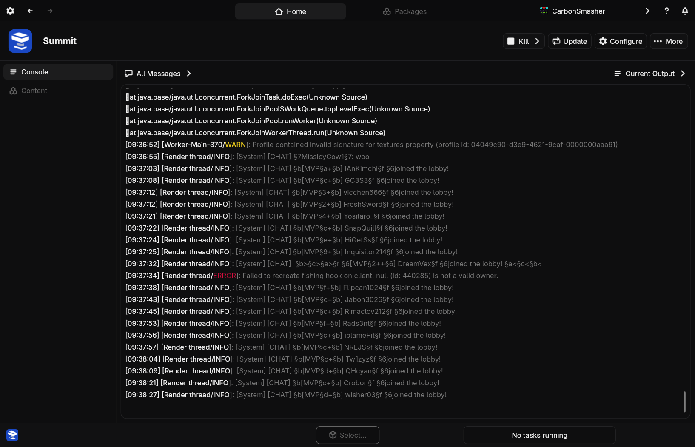

# Managing Running Instances

This is about how to manage instances as they are running. To launch an instance, see the [getting started](getting_started.md) guide.

## Seeing Running Instances

+++ App
Running instances will be visible at all times in the bottom left footer. You can click on any of the icons to go to the instance's page.
+++ CLI
Run `nitro instance status` to see a list of running instances and their PIDs.
+++

## Killing Instances

When an instance freezes or stops working properly, you might need to kill it to make it stop.

!!!warning Warning
Killing an instance may result in corrupted files or loss of save data. It should only be done as a last resort.
!!!

+++ App
Navigate to the instance's page by clicking the instance in the running instance list in the bottom left. In place of the launch button will now be a `Kill` button which will kill the instance.
+++ CLI
Run `nitro instance kill <instance>`.
+++

## Seeing Instance Output

While an instance is running, it will output messages and information to the console.

+++ App
Navigate to the instance's page. Switch to the `Console` tab and see the output.

+++ CLI
When you launch the instance, its output will be visible in the console. There is no way to see the live output of a background-running instance at this time.
+++

## Viewing Logs

+++ App
Navigate to the instance's console, and use the dropdown at the top to select a recent log file to view.
+++ CLI
Run the `nitro instance logs <instance>` command to browse and view logs from the instance.
+++

## Commanding Servers

With server instances, you can send console commands to manage the server in real time.

+++ App
Navigate to the instance console and send commands using the input bar at the bottom. Press enter to submit.
+++ CLI
In the original terminal where the instance was launched, type and press enter to send commands.
+++

## Running Without Nitrolaunch

Even after an instance is launched, Nitrolaunch will continue running to handle plugins and input/output.

+++ App
You can close the Nitrolaunch app while your instances are running, which will stop any plugins that run periodically while the instance is running, or ones that do something when the instance stops. It is probably better to simply minimize the app if you care about these plugins running.
+++ CLI
Since Nitrolaunch simply keeps running until the instance stops, the only way to kill the tiny Nitrolaunch parent process is to kill it with an external task manager.
+++
